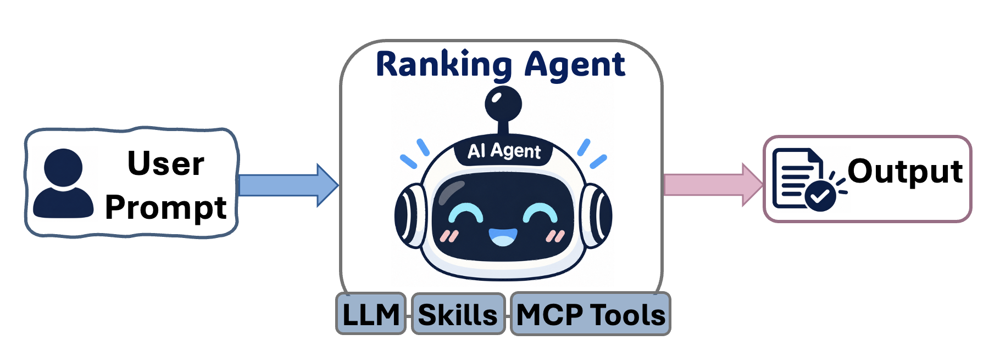
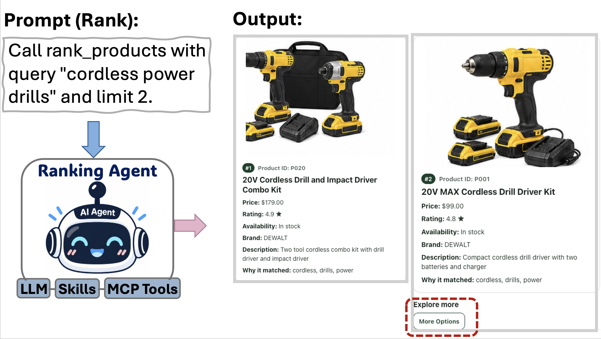

**Agent name:** Product Search & Ranking Agent (`product-ranking-agent`)

An MCP server that searches a synthetic product catalog and returns transparent, image-first product recommendations.

## Key features

- Searches catalog products and ranks in-stock matches.
- Scores relevance using rating and historical campaign signals.
- Returns Product Insight cards with product images in compatible MCP clients.
- Explains ranking decisions and exposes inventory and campaign metrics.
- Includes a Codex skill for routing product-search requests to the right MCP tool.

## Flow Chart



## Prerequisites

- Python 3.11+
- `pip` — Python's package installer
- An MCP-compatible client, such as ChatGPT, to use the tools and visual result cards

## Installation

1. Create and activate a mamba environment:

```bash
mamba create -n product-ranking python=3.11
mamba activate product-ranking
```

2. Install the published package from PyPI into the activated environment:

```bash
python3 -m pip install product-ranking-agent
```

## Quick start

Start the server:

```bash
product-ranking-agent
```

Connect your MCP client to `http://127.0.0.1:8000/mcp`, then begin a new chat so it loads the current tools.

## Skill Installation

Install the bundled Product Search Results skill into the current project:

```bash
product-search-install-skill
```

To install it into a different project, provide that project's path:

```bash
product-search-install-skill --project /path/to/project
```

If that project already has this skill and you want to replace it, add `--force`.

## Application example




## Documentation

For setup, client configuration, tool details, deployment, packaging, and development, see the [getting-started guide](docs/getting-started.md) and the rest of the [docs](docs/) folder.

## License and citation

This project is licensed under the [MIT License](LICENSE). If you use this work in research or other published work, see [CITATION.cff](CITATION.cff) for the preferred citation.
